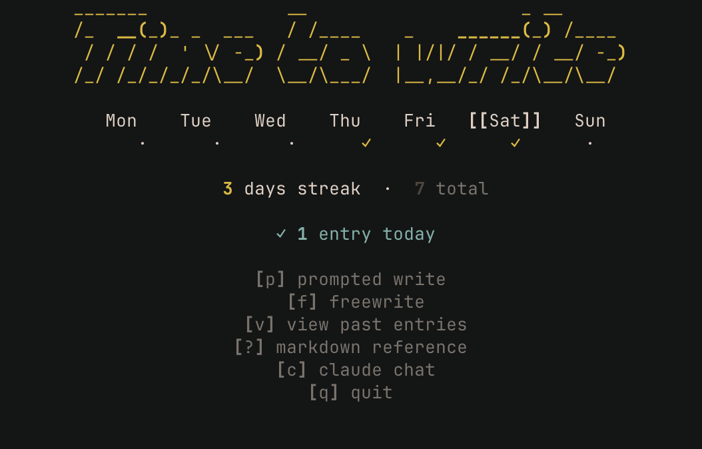

# journal

A minimal terminal journaling app. Write dated entries, track streaks, and optionally
chat with Claude — all from the command line.



---

## Features

- Full-screen multiline editor with markdown syntax highlighting
- Prompted or freewrite modes
- Weekly tracker and streak derived from the filesystem (no state file)
- Entry browser and viewer with markdown rendering
- Auto-push entries to a private git repo after every save
- Optional Claude chat mode (session-only, never written to disk)

---

## Requirements

- Python 3.9+
- Git (for auto-backup)

---

## Setup

### 1. Clone the repo

```bash
git clone <your-repo-url> ~/journal
```

### 2. Install dependencies

```bash
pip install rich prompt_toolkit anthropic python-dotenv pyfiglet readchar
```

### 3. Configure

Create `~/journal/.env`:

```
JOURNAL_DIR=/Users/yourname/journal
```

To enable Claude chat, add your Anthropic API key:

```
ANTHROPIC_API_KEY=sk-ant-...
```

If `ANTHROPIC_API_KEY` is absent, the app launches normally — the `[c]` option simply
won't appear.

### 4. Set up the `journal` command

Add an alias to your shell config so you can launch the app by typing `journal`:

**zsh** (`~/.zshrc`):
```bash
alias journal="python3 ~/journal/journal.py"
```

**bash** (`~/.bashrc` or `~/.bash_profile`):
```bash
alias journal="python3 ~/journal/journal.py"
```

Then reload your shell:
```bash
source ~/.zshrc   # or ~/.bashrc
```

Now you can open the app from anywhere:
```bash
journal
```

---

## Usage

| Key | Action |
|-----|--------|
| `p` | Prompted write (random prompt from `prompts.txt`) |
| `f` | Freewrite |
| `v` | Browse and view past entries |
| `?` | Markdown formatting reference |
| `c` | Claude chat (requires API key) |
| `q` | Quit |

### In the editor

| Key | Action |
|-----|--------|
| `Ctrl+S` | Save and exit |
| `Ctrl+Q` | Discard (always confirms) |
| `F1` | Markdown reference (text preserved) |
| `F2` | Toggle ASCII banner |

---

## File structure

```
journal/
├── entries/          # Auto-created; one .md file per session (gitignored)
├── prompts.txt       # 561 writing prompts, one per line
├── journal.py        # The whole app — single file
├── .env              # Your config (gitignored)
└── .gitignore
```

Entries are plain markdown files named `YYYY-MM-DD_HHMMSS.md`. Human-readable without
the app, and rendered natively on GitHub.

---

## Git backup

After every save, the app stages `entries/` and pushes to the remote. Failure is
non-fatal — a warning is shown and your entry is always saved locally first.

To connect to your own private repo:

```bash
cd ~/journal
git remote set-url origin <your-private-repo-url>
```
